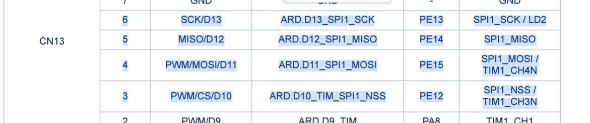
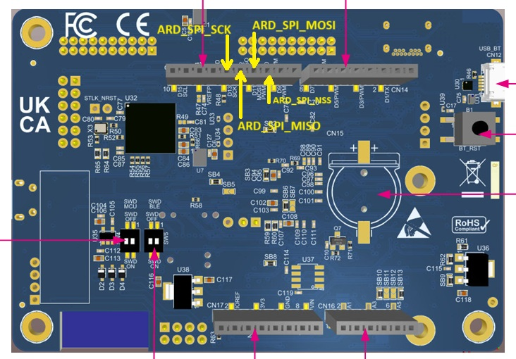
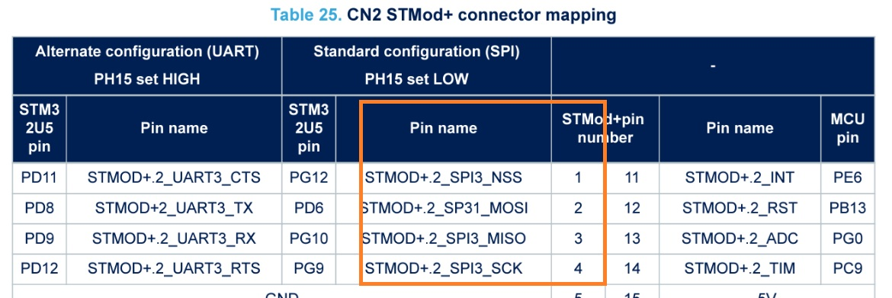
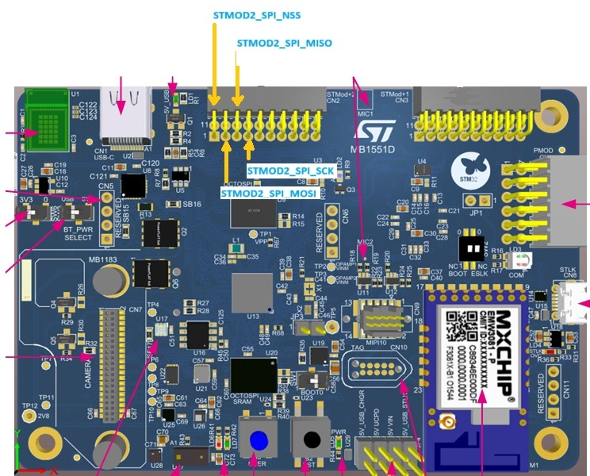

# B-U585I-IOT02A_SPI_STMOD_2
* Two SPI interfaces configured. SPI1 and SPI2.
* SPI1 is connected to the ARDUINO connector
* SPI3 is connected to the STMOD+ 2 connector.

## ARDUINO Pins connections
* ARD_D13: SPI1_NSS  (ARD_SPI_NSS)
* ARD_D12: SPI1_MOSI (ARD_SPI_MOSI)
* ARD_D11: SPI1_MISO (ARD_SPI_MISO)
* ARD_D10: SPI1_SCK  (ARD_SPI_SCK)





## STMOD+2 Pins connections

* STMOD2_1: SPI3_NSS  (STMOD2_SPI_NSS)
* STMOD2_2: SPI3_MOSI (STMOD2_SPI_MMOSI)
* STMOD2_3: SPI3_MISO (STMOD2_SPI_MISO)
* STMOD2_4: SPI3_SCK  (STMOD2_SPI_SCK)





## Code examples

### USE SPI1 connected to ARDUINO

  ```
  HAL_GPIO_WritePin      ( ARD_SPI_NSS_GPIO_Port, ARD_SPI_NSS_Pin, GPIO_PIN_RESET);
  HAL_SPI_TransmitReceive(&ARD_SPI, tx_data_2, rx_data_2,DATA_SIZE_2, 0xFFFFFFFF);
  HAL_GPIO_WritePin      ( ARD_SPI_NSS_GPIO_Port, ARD_SPI_NSS_Pin, GPIO_PIN_SET);
  ```

### USE SPI1 connected to STMOD2

  ```
  HAL_GPIO_WritePin      ( STMOD2_SPI_NSS_GPIO_Port, STMOD2_SPI_NSS_Pin, GPIO_PIN_RESET);
  HAL_SPI_TransmitReceive(&STMOD2_SPI, tx_data_1, rx_data_1,DATA_SIZE_1, 0xFFFFFFFF);
  HAL_GPIO_WritePin      ( STMOD2_SPI_NSS_GPIO_Port, STMOD2_SPI_NSS_Pin, GPIO_PIN_SET);
  ```